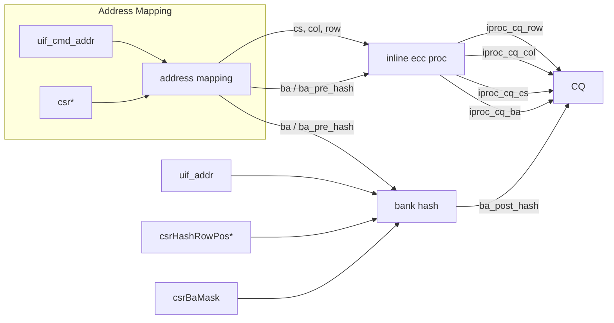
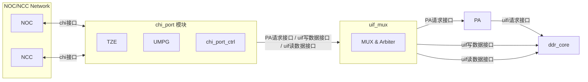

# 🐯 Tiger LPDDR5 验证分析文档库

> 本文档用于集中存放 Tiger LPDDR5 项目的验证分析、协议规范及架构设计等内容。后续有新的内容补充将持续追加至此。

---

## 1.4.3 数据传输接口

### 1.4.3.1 上行CHI接口

DMU数据传输接口上行采用的是CHIE（snf节点）协议，包含请求通道、写数据通道、读数据通道以及响应通道。主要特性如下：

1）请求通道支持任意合法size的WriteNoSnpFull、WriteNoSnpPtl、ReadNoSnp、ReadNoSnpsep、prefetchTgt以及CleanSharedPersist；对于写order一直为0，读支持0/1两种；另外写请求相关的写取消以及取消重传机制都是可以正常处理的。

2）对于cacheline请求，写、读数据通道都支持两拍数据前后连续传输、间隔传输、第二拍数据先传输第一拍数据后传输；

3）DDR5/LPDDR5模式下，ch0、ch1都会参与；

4）每个通道的chiport上行连接两组CHIG接口，分别对应于NoC(N0/1)与NCC Mesh(M0/1)。

**表 1-4 CHI相关接口信号描述**

| NoC信号 | NCC Mesh信号 | 位宽 | I/O | 描述 |
| :--- | :--- | :--- | :--- | :--- |
| **CHI接口链路层信号** | | | | |
| TXSACTIVE_N0/N1 | TXSACTIVE_M0/M1 | 1 | O | / |
| RXSACTIVE_N0/N1 | RXSACTIVE_M0/M1 | 1 | I | / |
| TXLINKACTIVEREQ_N0/N1 | TXLINKACTIVEREQ_M0/M1 | 1 | O | / |
| TXLINKACTIVEACK_N0/N1 | TXLINKACTIVEACK_M0/M1 | 1 | I | / |
| RXLINKACTIVEREQ_N0/N1 | RXLINKACTIVEREQ_M0/M1 | 1 | I | / |
| RXLINKACTIVEACK_N0/N1 | RXLINKACTIVEACK_M0/M1 | 1 | O | / |
| **CHI接口请求通道信号** | | | | |
| RXREQFLITPEND_N0/N1 | RXREQFLITPEND_M0/M1 | 1 | I | / |
| RXREQFLITV_N0/N1 | RXREQFLITV_M0/M1 | 1 | I | 请求有效信号 |
| RXREQFLIT_N0/N1 | RXREQFLIT_M0/M1 | 163 | I | 请求报文信号 |
| RXREQLCRDV_N0/N1 | RXREQLCRDV_M0/M1 | 1 | O | 请求信用指示信号 |
| **CHI接口响应通道信号** | | | | |
| TXRSPFLITPEND_N0/N1 | TXRSPFLITPEND_M0/M1 | 1 | O | / |
| TXRSPFLITV_N0/N1 | TXRSPFLITV_M0/M1 | 1 | O | 响应有效信号 |
| TXRSPFLIT_N0/N1 | TXRSPFLIT_M0/M1 | 73 | O | 响应报文信号 |
| TXRSPLCRDV_N0/N1 | TXRSPLCRDV_M0/M1 | 1 | I | 响应信用指示信号 |
| **CHI接口写数据通道信号** | | | | |
| RXDATFLITPEND_N0/N1 | RXDATFLITPEND_M0/M1 | 1 | I | / |
| RXDATFLITV_N0/N1 | RXDATFLITV_M0/M1 | 1 | I | 写数据有效信号 |
| RXDATFLIT_N0/N1 | RXDATFLIT_M0/M1 | 403 | I | 写数据报文信号 |
| RXDATLCRDV_N0/N1 | RXDATLCRDV_M0/M1 | 1 | O | 写数据信用指示信号 |
| **CHI接口读数据通道信号** | | | | |
| TXDATFLITPEND_N0/N1 | TXDATFLITPEND_M0/M1 | 1 | O | / |
| TXDATFLITV_N0/N1 | TXDATFLITV_M0/M1 | 1 | O | 读数据有效信号 |
| TXDATFLIT_N0/N1 | TXDATFLIT_M0/M1 | 403 | O | 读数据报文信号 |
| TXDATLCRDV_N0/N1 | TXDATLCRDV_M0/M1 | 1 | I | 读数据信用指示信号 |


## 1.5 重点功能理解

DMU是内存控制部件，包括Port、DDR controller、DDR PHY、TZE等核心模块，另有 RAS模块(中断处理、tdbg)、时钟复位管理(clk_rst_gen)、寄存器控制(APB_CTRL)、地址映射模块(addr_gen)、PDM性能监控等模块。

Port0/1用于对HN节点下发的CHI请求根据QoS进行处理和响应，同时实现CHI格式报文到UIF格式报文的转化。其中内嵌TZE安全部件在下面介绍；内嵌的地址映射模块，可以将系统发送的离散的地址转换为连续的物理地址，并根据配置的截位方法进行截位，具体截位方式与网络配置相关；内嵌的UMPG模块支持可编程pattern写内存，并读取校验，可在生成眼图和校验训练结果时运行。

TZE为兼容TrustZone协议的存储器安全管理部件，包含有TZC、加解密模块。TZC可将地址空间划分为8个安全域空间、1个SE专属的安全域空间和1个默认域空间，并对不同空间设置不同的访问权限和数据处理方法。加解密模块可对存储器访问数据使用SM4国密算法进行加解密处理，有选择地对安全域和/或普通域空间的数据进行加密和解密处理。

DDRC0/1为存储控制器的事务层控制处理部件，上行接口为addr_gen转换后的CHI接口，下行接口为与PHY连接的DFI接口，DDRC可以将事务层的CHI请求转换成DFI接口上的命令序列，之后通过MCI传输通道传递给PHY。

PHY为DDRC相连接的物理层部件，作为片外内存的直接DIMM接口，将DFI的命令序列转换成DIMM接口上的时序，其中内部的MCU与PTG结合起来完成DRAM的初始化、Training、BIST等。

PDM为DFI总线上的性能监控模块。RAS模块包含DMU的中断收集处理模块、以及原tdbg模块。

本项目中单个DIE包含8个CHA和4个SNF，由于snf的个数为2的幂次方，因此本次截位规则与ddr size无关，2的幂次方截位规则如下：

**图 1-16 DMU地址截位规则**

| Number of HN-Fs | Number of SN-Fs | Bits to strip from full PA |
| :--- | :--- | :--- |
| 2 | 1 | None |
| | 2 | [6] |
| 4 | 1 | None |
| | 2 | [7] |
| | 4 | [7, 6] |
| 8 | 1 | None |
| | 2 | [8] |
| | 4 | [8, 7] |
| | 8 | [8, 7, 6] |

### 1.5.2.2 自定义地址映射

DMU自定义地址映射模块addr_gen可将系统发送的离散地址映射到物理的连续地址。Tiger包含两段DRAM空间，以使用单通道容量共32GB的DIMM模型为例，具体介绍如下：

1）配置第一段空间。第一段空间基地址为0x80000000 (2G)，空间大小为2G，也就是将系统地址空间的2-4GB映射到DMU内部连续物理地址空间的0-2GB；寄存器 `dmu_reg_addr_base_region0_ch0/ch1` 配置为 `0x0002` (2G) ，`dmu_reg_addr_size_region0_ch0/ch1` 配置为 `0x0002` (2G)。

2）配置第二段空间。第二段空间基地址为0x80_00000000 (512G)，空间大小为30G，也就是将系统地址空间的512G-542GB映射到DMU内部连续物理地址空间的2-32GB；寄存器 `dmu_reg_addr_base_region1_ch0/ch1` 配置为 `0x200` (512G) ，`dmu_reg_addr_size_region1_ch0/ch1` 配置为 `0x001e` (30G)。

3）如需使用第三段DRAM空间，则需配置寄存器 `dmu_reg_addr_base_region2_ch0/ch1`、`dmu_reg_addr_size_region2_ch0/ch1`；

4）如需使用第四段DRAM空间，则需配置寄存器 `dmu_reg_addr_base_region3_ch0/ch1`、`dmu_reg_addr_size_region3_ch0/ch1`。

**图 1-17 系统地址空间划分**

| 地址空间 | 设备 | 访问接口 |
| :--- | :--- | :--- |
| 0x00_00000000~0x00_0FFFFFFF | QSPI 256MB | 转发LSD接口 |
| 0x00_10000000~0x00_1FFFFFFF | LSD 256MB (包含LPC 128MB) | AXI4 |
| 0x00_20000000~0x00_27FFFFFF | MISC: 128MB 其他部件空间，包含各子网络配置空间 | AXI, APB, AHB... |
| 0x00_28000000~0x00_2BFFFFFF | 高速外设配置: USB, SATA, MAC, DC, PCIE 64MB | AXI, APB |
| 0x00_2C000000~0x00_2FFFFFFF | Reserved, 64MB | 默认到HND |
| 0x00_30000000~0x00_3FFFFFFF | NoC 256MB | 高速网络空间 |
| 0x00_40000000~0x00_7FFFFFFF | PCIE的配置、MEM32空间, 1GB | AXI4/512/1000M |
| 0x00_80000000~0x00_FFFFFFFF | Memory空间, 2GB | CHI/2G |
| 0x01_00000000~0x01_7FFFFFFF | QSPI, 2GB | 转发到LSD端口 |
| 0x01_80000000~0x1F_FFFFFFFF | Reserved, 122GB | 默认到HND |
| 0x20_00000000~0x3F_FFFFFFFF | CXL.mem空间, 128GB | |
| 0x40_00000000~0x7F_FFFFFFFF | PCIE的MEM64空间, 256GB | AXI4/512/1000M |
| 0x80_00000000~0xFF_FFFFFFFF | 64位扩展Memory空间 | CHI/2G |

DMU自定义地址映射模块addr_gen还支持地址截位。由于从NOC过来的请求地址是经过hash处理的，落入DDR地址是离散的，将请求地址剥离部分地址可以得到连续地址。配置 `dmu_reg_addr_strip_bits_lo_ch0/ch1`、`dmu_reg_addr_strip_bits_hi_ch0/ch1` 对应位为1，截取相应地址bit位。截位请查看noc-sam映射规则。

### 1.5.2.3 DDRC行列地址映射

经过addr_gen处理的chi地址变为连续地址，再经过DDRC的地址映射，将DDRC的输入地址转换为dimm端的地址，整个DDRC的映射过程分为两部分：

- **完成CHI地址到UIF地址映射**

  根据DRAM命令数据的长度将CHI命令拆分为多个UIF命令，有效位数的减少是基于DRAM数据长度计算出来的。例如：

  ddr burst size=64B时，它减少了log2(64) = 6个有效位，相当于地址右移6位，UIF接口地址位宽为35，对应CHI地址位宽有效位为[40:6]，即 `uif_addr[34:0]=chi_addr[40:6]`。

- **完成UIF地址到DRAM的地址映射**

  采用接口一对一映射配置，DRAM地址的cs、row、col、ba、bg均可通过寄存器进行配置，例如配置 `csrRow16Pos = 6'd28`, `csrCol5Pos = 6'd3`，则 `uif_addr[28]` 映射为 `row[16]`，`uif_addr[3]` 映射为 `col[5]`。

  初始化采用 `row[16:0]->cs[1:0]->ba[1:0]->col[5:0]->bg[2:0]` 映射方式，以x8 32G 4rank为例，具体配置如下：

| 寄存器 | 配置值 |
| :--- | :--- |
| csrBa2Pos | 'd0 |
| csrBa3Pos | 'd1 |
| csrBa4Pos | 'd2 |
| csrCol0Pos | 'd3 |
| csrCol1Pos | 'd4 |
| csrCol2Pos | 'd5 |
| csrCol3Pos | 'd6 |
| csrCol4Pos | 'd7 |
| csrCol5Pos | 'd8 |
| csrBa0Pos | 'd9 |
| csrBa1Pos | 'd10 |
| csrCs0Pos | 'd11 |
| csrCs1Pos | 'd12 |
| csrRow0Pos | 'd13 |
| csrRow1Pos | 'd14 |
| csrRow2Pos | 'd15 |
| csrRow3Pos | 'd16 |
| csrRow4Pos | 'd17 |
| csrRow5Pos | 'd18 |
| csrRow6Pos | 'd19 |
| csrRow7Pos | 'd20 |
| csrRow8Pos | 'd21 |
| csrRow9Pos | 'd22 |
| csrRow10Pos | 'd23 |
| csrRow11Pos | 'd24 |
| csrRow12Pos | 'd25 |
| csrRow13Pos | 'd26 |
| csrRow14Pos | 'd27 |
| csrRow15Pos | 'd28 |
| csrRow16Pos | 'd29 |

### 1.5.2.4 Bank Hash (2.7.1)

Bank hashing is used to improve overall performance when a contiguous address pattern maps to different rows within the same bank. （当连续的地址模式映射到同一个 Bank 内的不同行时，Bank Hash 功能主要用于提升内存访问的整体性能。）

配置逻辑 (以 `CTL_BANK_NUM_W` 为例，支持 5/4/3 等配置)：
每一位 `ba_hash[i]` 的生成逻辑本质上是对多个掩码后的行地址位进行异或 (XOR)，然后再与原始的 `ba[i]` 进行异或，最后由 `csrBaMask[i]` 决定是否使能该位的 Hash。


*图 2-11 Bank Hash 逻辑结构图*

`csrHashRowPos${i}` 的值指定了将要使用 UIF 地址的哪一个比特位；所有的 `csrHashRowPos` 寄存器配置值必须是唯一的，并且必须映射到不同的行（row）比特位上，也就是说，每一行（row）的比特位都必须分配给一个不重复的 `csrHashRowPos`。

**时序优化说明 (Timing Optimization)**:
当开启 `CTL_IECC_EN = 1` (内联ECC使能) 且 `CTL_BANK_HASH_EN = 1` (Bank哈希使能) 时，将适用上述的 Bank Hash 结构图：与内联 ECC 相关的逻辑直接使用的是哈希前地址 (`ba_pre_hash`)，而发送到命令队列 (CQ) 的则是哈希后地址 (`ba_post_hash`)。这样设计的目的是为了优化硬件的时序路径。

**表 2-38 Bank Hash 地址选择配置寄存器**

| 寄存器名称 | 方向 | 位宽 | 描述 |
| :--- | :--- | :--- | :--- |
| `csrBankHashEn` | 输入 | 1 | 1'b0: 关闭 Bank Hash 功能 <br> 1'b1: 开启 Bank Hash 功能 |
| `csrUifAddrRowMask` | 输入 | \`CTL_CMD_ADDR_W | 指定 UIF 地址中用于提取 row（行）地址的掩码，对应位为 1 表示有效。 |
| `csrHashRowPos0` | 输入 | \`CTL_ADDR_POS_W | `CsrHashRowPos${i}` 的值指定了在被掩码过滤后的 UIF 地址中，提取哪一个比特位来参与哈希运算。 |
| ... | | | |
| `csrHashRowPos17`| 输入 | \`CTL_ADDR_POS_W | 同上，指定提取哪一个比特位参与哈希运算。 |


### 1.5.2.5 验证说明

将沿用Tanji2C项目断言去检查地址映射的正确性，并结合ras有关地址越界的中断检查，后续将继续对断言进行维护更新以确保符合Tiger项目要求。

### 1.5.3 chi-port功能说明(何俊浩)

Chi_port为DDR控制器的接口模块，用于对HN节点下发的CHI请求进行处理和响应，同时实现CHI格式报文到UIF格式报文的转化。内嵌的TZE模块在后续进行介绍。



*(图 1-18 chi_port整体结构图)*


UT环境中的功能点在集成环境中均会进行测试，在集成测试中主要对一些功能点进行重点验证：

1. **与PDM模块集成测试**：
   1) 计数相关测试：chi_port中HPR/LPR接收到得相关命令、opcode类型和hpr/lpr命令retry等信息将会引出到PDM模块中进行相关计数。
   2) debug相关测试：chi_port中响应通道队列状态，协议错误检查以及数据注错等功能将会结合PDM验证信息记录得正确性。

2. **与dmu控制器集成测试**：
   1) DM和ECC混合测试，确保相应功能开启后，在port内部能够将部分字写请求转换为MWR或者RMW命令类型。
   2) 与CAM相关功能测试：通过超时机制触发CAM中gpw_go2critical/gpr_go2critical告知ddrc加速对TPW/LPR得调度。
   3) 写数据poison功能测试：在开启ECC的情况下，若wr_poison不为0，则经过uif透传到ddrc后，对ECC进行注错污染，以便读出时产生ECC错误使得rd poison不为0，表明该数据已被污染。
   4) 读数据反压测试：验证新增的rd_fifo_is_full信号传给ddrc后，ddrc不会再发出新的读命令。
   5) CRC混合测试：需要验证CRC的读数据时序、以及resperr。

   6) active-bypass：需要验证port与active-bypass混合测试的正确性。
   7) ddrc低功耗阻塞：需要验证port与ddrc在进入低功耗或切频时的交互。
   8) 数据通路测试：需要验证数据通路的转换桥。

3. **与UMPG混合测试**：在使能umpg测试算法，开启循环测试的同时发送大压力读写请求，测试控制器在测试算法未完成前时，读写请求能否发送到DIMM端。

4. **与RAS混合测试**：错误检测中断测试。

除以上内容外，chi-port本次新增双通道链路处理、流量计算cbusy、流控功能、port动态时钟关断、port自动rst等功能，其中：
- chiport的功能会在ut先进行验证，并在it进行全部回归。
- uif数据接口的转换桥会额外搭建环境，上面挂uif master下面挂uif slave进行验证。

以下针对修改且需要在it进行集成验证的部分进行介绍。

#### 1.5.3.1 读数据反压通路

ChiPort内部的 `chi_rdat_dbif` 新增了一个 `ot_counter`。当读cam传过来的 `rd_has_been_sent` 信号拉高一拍，表示后续一定会有一笔读数据返回，此时 `ot_counter+1`；当 `pop_fsm` 输出的 `data_has_been_sent` 拉高一拍，则表示一次读请求的数据从chi_rdat返回，此时 `ot_counter-1`；当 `ot_counter` 计数值达到chi_rdat_fifo的深度时则认为rdat_fifo已满，拉高 `rd_fifo_is_full` 信号传给读cam，此时读cam不会再发出新的读命令。

#### 1.5.3.2 resperr混合测试

对于读数据返回时产生的错误响应信号resperr，按照如下优先级覆盖。由于ut环境的crc err为模型配置，因此在it环境需要与crc注错进行混合测试确保resperr的正确性。


```mermaid
graph TD
    subgraph ① 协议级/TZE错误 (最高优先级)
        ERR_PROTO[chi_req域段错误或TZE拦截]
        OUT_PROTO[返回 resperr'h3]
    end

    subgraph ② Poison错误 (中优先级)
        ERR_POISON[发生ECC错误, poison非全0]
        OUT_POISON[返回 resperr'h2]
    end

    subgraph ③ CRC错误 (最低优先级)
        ERR_CRC[uif接口返回crc错误指示]
        OUT_CRC[返回 resperr'h2]
    end

    ERR_PROTO --> OUT_PROTO
    ERR_POISON -->|未触发协议错误时| OUT_POISON
    ERR_CRC -->|未触发Poison错误时| OUT_CRC
```
*(图 1-19 chi_rdat_arb中针对resperr的处理流程)*


优先级最高的错误为图中③指示的协议级错误，该错误为在chi_req生成并存入到rdat_info中的域段信息，发生时会返回 `resperr'h3`，或者tze判定这个读非法并配置 `reaction_value[0]` 为1时，返回 `resperr'h3`；其次是poison错误，当发生ECC错误时poison会不为全0，在使能 `param_chi_derr_signalization` 的情况下会返回 `resperr'h2`；优先级最低的是crc错误，当uif接口返回的数据指示发生crc错误时，在使能 `param_crc_derr_signalization` 的情况下会返回 `resperr'h2`。

#### 1.5.3.3 port autorst

chiport新增了autorst功能，由于在ut环境中验证的时候是通过在环境top层做的逻辑，因此需要在it进行集成验证。

#### 1.5.3.4 错误检测

chi_port的错误可能发生在请求通道、读数据通道和写数据通道，以下将会报给ras的中断标黄。

**表 1-13 chi_port中错误检测的场景与处理方式说明**

| 通道 | 错误场景 | 处理方式 |
| :--- | :--- | :--- |
| 请求通道 | 非法opcode | - 忽略该请求；<br>- `chi_req_decode`模块检测到非法opcode，产生`req_error_type`，并记录请求信息，共同输出至PDM模块；<br>- **产生`port_invld_op_int_p`脉冲中断，并上报ras，ras不记录地址。** |
| 请求通道 | WriteNoSnpFull请求的be不全为1 | - **产生`full_be_err_int_lvl`电平中断，并上报ras；**<br>- 记录错误场景发生时的首个错误地址。 |
| 请求通道 | WriteNoSnpFull请求的size不为6 | - 纠正请求的size，请求正常进入到ddr_core处理，并且在响应域段将RespErr置为`2'b11`，表示发生非数据错误；<br>- `chi_req_decode`模块检测到该协议错误(`protocol_err_p4`)，产生`req_error_type`，并记录请求信息，共同输出至PDM模块；<br>- **产生`port_wrful_nsz6_int_p`脉冲中断，并上报ras，ras不记录地址。** |
| 请求通道 | ReqLcrdReturn请求Txnid不为0 | - 忽略该请求；<br>- `chi_req_decode`模块检测到该协议错误(`protocol_err_p1`)，产生`req_error_type`，并记录请求信息，共同输出至PDM模块；<br>- **产生`port_lcrdret_ertxnd_int_p`脉冲中断，并上报ras，ras不记录地址。** |
| 请求通道 | PrefetchTgt请求Allowretry不为0 | - 忽略该请求；<br>- `chi_req_decode`模块检测到该协议错误(`protocol_err_p2`)，产生`req_error_type`，并记录请求信息，共同输出至PDM模块。 |
| 请求通道 | TgtID不正确 | - 请求忽略。 |
| 请求通道 | PCQ队列溢出 (发生读命中，但是保存读请求信息的队列已满) | 该场景仅在PCQ队列深度小于预取buffer数量的时候才会发生，处理方式如下：<br>- 命中的读请求不作废，作为正常的进入到请求队列；<br>- 产生`status_chi_pref_pcq_ovf`中断信号。 |
| 响应通道 | 不符合协议请求 | - 响应通道返回`resperr`标记非数据错误 (前序项目已实现)； |
| 响应通道 | tze判定非法的请求 | - 响应通道返回`resperr`标记非数据错误 (本方案实现)； |
| 写数据通道 | chi_wdat_poison = 1 | - 通过`uif_wr_poison`传递到ddr_core；<br>- 在ECC使能的情况下，该信号才有意义 (但是否污染ECC还需要ddr_core中的寄存器控制)，否则忽略；<br>- 在`write_poison_corrupt_ecc_en`或者`ecc_en`为0的情况下，有效数据对应的poison为1，则产生中断信号`wdat_data_corrupted`，并将写数据信息同步到PDM模块。 |
| 写数据通道 | chi_wdat_resperr != 00 | - 发生`chi_wdat_resperr != 00`，可以配置`chi_derr_signalization`使得可以将写数据的poison全部置1，并传递到ddr_core中；<br>- 在`chi_derr_signalization`拉高并且`write_poison_corrupt_ecc_en`或者`ecc_en`两个信号中有一个为0，则产生中断信号`wdat_data_corrupted`，并将写数据信息同步到PDM模块。 |
| 写数据通道 | 写数据报文的Txnid和已经分配的写数buffer的DBID匹配不上 | - 视为严重协议错误：<br>- 产生中断信号`wdat_wrong_dbid`，并将写数据信息同步到PDM模块。<br>- **产生`port_wdat_erdbid_int_p`脉冲中断，并上报ras，ras不记录地址。** |
| 写数据通道 | 出现非法的DataID | - 视为严重协议错误：<br>- 产生中断信号`wdat_wrong_dataid`，并将写数据信息同步到PDM模块。<br>- **产生`port_wdat_erdataid_int_p`脉冲中断，并上报ras，ras不记录地址。** |
| 写数据通道 | 出现多余的写数据 | - 写数据buffer接收到额外的写数据报文 (大于请求量)；<br>- 多余的报文忽略，产生中断信号`wdat_wdb_ovf`，并将写数据信息同步到PDM模块。 |
| 写数据通道 | 出现非法的TargetID | - 忽略该写数据报文 |
| 写数据通道 | 出现非法的Opcode | - 忽略该写数据报文 |
| 读数据通道 | uif_wr_poison=1 | - 通过`chi_rdat_poison`信号传递到上游；<br>- 在ECC使能的情况下，该信号才有意义，否则忽略；<br>- 检测到`uif_wr_poison`为1，可以配置`chi_derr_signalization`在读数据通道产生DERR；<br>- ECC不使能的情况下，`uif_wr_poison`始终为0。 |

#### 1.5.3.5 验证说明

ChiPort在it环境下的验证的重点如下：
- **协议升级**。需要将chi_uvc适配chiG协议。
- **ut环境的激励回归**。需要将所有ut环境的功能点对应的激励进行回归测试。
- **新增的与ddrc结合的功能**。
  - 读数据反压通路。需要编写断言确保在port将`rd_fifo_is_full`拉高后，ddrc不会再返回新的读数据；
  - CRC、TZE、协议错误混合测试。需要混合测试在CRC、TZE、协议错误交叉发生时`resperr`的正确性，开发断言保证正确性；
  - active-bypass混合测试。需要编写断言确保port给到active-bypass的开行地址正确；
  - 低功耗混合测试。由于控制器修改较大，port也新增了动态时钟关断，低功耗交互信号需要编写断言重点关注；
  - uif数据转换桥测试。该转换桥会先进行ut验证、随后在chiport ut进行验证，但是也要确认下行的ddrc集成时不会出现问题。
- **新增的中断验证**。需要确认错误处理中的中断都能够正常触发并处理。

